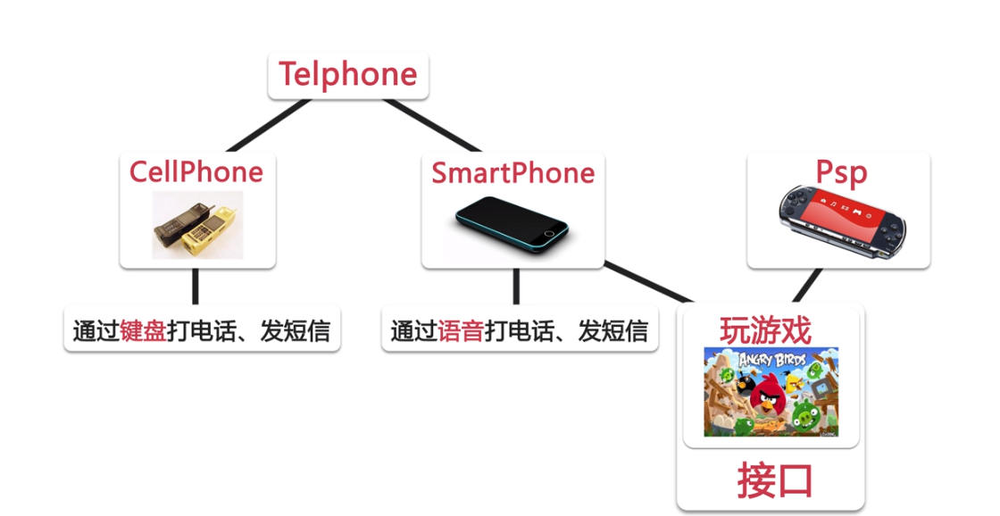

# 借口

* 概念：
1. 接口可以理解为一种特殊的类，是由**全局常量**和**公共的抽象方法**所组成。
2. interface 关键字

   ~~~ java
   // 定义接口，注意如果定义接口和方法都没有写 abstract，也可以，因为系统会默认将 abstract 加上。
   修饰符 abstract interface 接口名 [extends 父接口0, 父接口1, 父接口2 ...]
   {
		// 0 ~ n 个常量定义
      public static final 常量名 = 常量值;
      // 0 ~ n 个抽象方法的定义
      public abstract 方法类型 方法名称(参数0, 参数1, ...){
      }
   }
   ~~~
 
   ~~~ java
   // 一个类继承另一个类，并实现接口
   修饰符 class 类名 extends 父类 implements 接口0, 接口1 ...
   {
      // 如果继承了抽象类，就必须实现抽象类中的抽象方法
      // 如果实现了接口，就必须实现接口中的方法
   }
   ~~~

~~~ java
public interface A {
	public static final int a = 0;
	public abstract void print();
}

public interface B extends A{
	public static final int a = 1;
	public abstract void show();
}

public class TestInterface implements B {
	public static void main(String[] args) {
		// TODO Auto-generated method stub
		TestInterface ti = new TestInterface();
		System.out.println(A.a);
		System.out.println(B.a);
	}
	@Override
	public void print() {
		// TODO Auto-generated method stub
		
	}
	@Override
	public void show() {
		// TODO Auto-generated method stub
		
	}
}
~~~

http://yinny.iteye.com/blog/1152430
