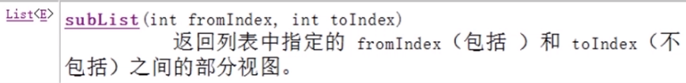

# 分页

* 常见的分页实现方式：
  1. 使用 List 接口中 subList(int startIndex, int endIndex) 方法实现分页。
  

  2. 直接使用数据库 SQL 语句实现分页。
     * 利用数据库中自带的分页语法，使用分页语句，获取分页数据（例如 mysql, postgresql 数据库使用 limit 关键字， oracle 中使用 rownum 关键字）
  3. 使用 hibernate 等框架实现跨数据库的分页。
